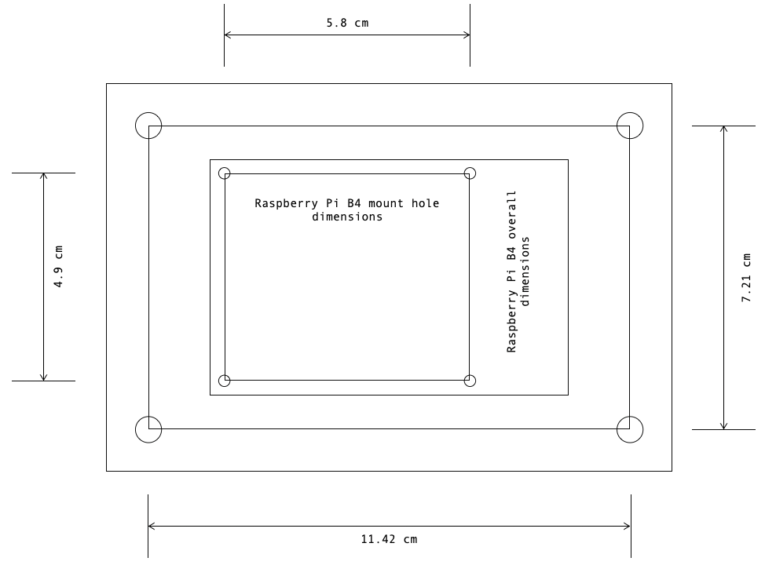

# ChristmasSocks
C++ socket utilities for my various other projects. This project also depicts my workflow for working with C++ projects.

## Compiling a test binary
To compile a test binary, run the following:
```bash
$ cd /path/to/ChristmasSocks
$ chmod +x ChristmasSocks/configure.py
$ ./ChristmasSocks/configure.py compile
```
This will compile a binary under:
```
/path/to/ChristmasSocks/ChristmasSocks/bin/socks
```

## Static analysis
To lint the C++ source, run:
```bash
$ cd /path/to/ChristmasSocks
$ ./ChristmasSocks/configure.py lint
```
As of right now, this project uses [cppcheck](http://cppcheck.sourceforge.net/) for static analysis.

## Testing locally
To test a binary that was compiled following the instructions under [Compiling a test binary](#compiling-a-test-binary), run:
```bash
$ cd /path/to/ChristmasSocks
$ ./ChristmasSocks/configure.py test
```

## Testing with Docker
To run tests with Docker, first make sure that Docker is installed. Then run:
```bash
$ cd /path/to/ChristmasSocks
$ docker build -t socks .
```
This will generate a Debian based local Docker image. To actually test the product, run the `socks` image:
```bash
$ docker run -it --rm socks
```
The Dockerfile will simply run the steps:
- [Compiling a test binary](#compiling-a-test-binary)
- [Testing locally](#testing-locally)

But within the container itself.

## Testing hardware
I use a Raspberry Pi cluster for testing this product. The individual nodes are mounted on an optical table using a plexiglass mount.
To make these mounts, I simply print out the `.pages` document under the `other` folder, paste the printout onto a plexiglass sheet
and cut out the shape according to the template. The circles are nothing than drill hole markers.
<p align="center">
  
</p>
Unsurprisingly, this section is completely optional, but this happens to be a convenient place to keep these diagrams.
