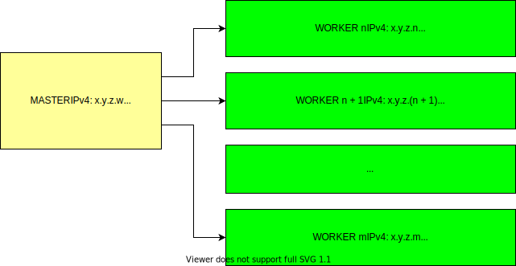

# ChristmasSocks Remote Server Management Software
Another one of the many remote server management utilities available out there. I build this mainly out of
personal interest and for accelerating my workflow. This project essentially consists of several
[epoll](https://linux.die.net/man/4/epoll) driven servers that whom receive commands from a master client.
## Table of Contents
  - [Synopsis](#synopsis)
  - [Static analysis](#static-analysis)
  - [Compiling a test binary](#compiling-a-test-binary)
    - [To compile a `CMAKE_BUILD_TYPE=Release` binary](#to-compile-a-cmake_build_typerelease-binary)
    - [To compile a `CMAKE_BUILD_TYPE=RelWithDebInfo` binary](#to-compile-a-cmake_build_typerelwithdebinfo-binary)
  - [Testing](#testing)
    - [Testing a `CMAKE_BUILD_TYPE=Release` binary](#testing-a-cmake_build_typerelease-binary)
    - [Running memory tests](#running-memory-tests)
    - [Testing with Docker](#testing-with-docker)
    - [Manual testing](#manual-testing)
  - [Shortcuts](#shortcuts)
  - [Testing hardware](#testing-hardware)

## Synopsis
The following block diagram summarizes the distributed architecture underpinning this software:
<p align="center">
  

The architecture consists of the following components:
| Component | Description |
| --------- | ----------- |
| **Master** | This node queries all the worker nodes. Information |
|            | returned from the nodes is then neatly displayed on the master node for analysis |
| **Worker** | These nodes accept commands from the master node. Commands can then return information about
each node, for example whether the node is up, the CPU temperature, among others |
## Static analysis
To lint the C++ source, run:
```bash
./configure.py lint
```
As of right now, this project uses [cppcheck](http://cppcheck.sourceforge.net/) for static analysis.
## Compiling a test binary
### To compile a `CMAKE_BUILD_TYPE=Release` binary:
Run the following:
```bash
./configure.py compile --release
```
This will compile a binary under:
```
./bin/socks
```
The `--release` flag can also be omitted as the system will default to compiling a release binary:
```bash
./configure.py compile
```
### To compile a `CMAKE_BUILD_TYPE=RelWithDebInfo` binary:
Run the following:
```bash
./configure.py compile --debug
```
This will, again, compile a binary under:
```
./bin/socks
```
## Testing
### Testing a `CMAKE_BUILD_TYPE=Release` binary:
To test a binary that was compiled following the instructions under [Compiling a test
binary](#compiling-a-test-binary), run:
```bash
./configure.py test --release
```
The `--release` flag can also be omitted as the system will default to testing the release binary:
```bash
./configure.py test
```
### Running memory tests:
```bash
./configure.py test --memory
```
This project uses [Valgrind](https://valgrind.org/) for all dynamic analysis.
### Testing with Docker
To run tests with Docker, first make sure that Docker is installed then change directories to the project
root:
```
cd /path/to/ChristmasSocks
```
Then run:
```bash
docker build -t socks .
```
This will generate a Debian based local Docker image. To actually test the product, run the `socks` image:
```bash
docker run -it --rm socks
```
The Dockerfile will simply run the steps:
- [Compiling a test binary](#compiling-a-test-binary)
- [Testing](#testing)

But within the container itself.
### Manual testing
Manual testing can be done using [netcat](https://linux.die.net/man/1/nc) (`nc`). First, start the server:
```bash
./bin/socks --port 1234 # Or whatever port TCP port you wish to use
```
Then start an `nc` interactive session:
```
$ nc localhost 1234
echo
echo  # echoed back from the server
exit
```
The `exit` command will shut down the server. The server accepts EOL line endings, and therefore can
technically accept incoming Windows client connections, however support for this is poorly tested. First start
the server as follows:
```bash
./bin/socks --bind-ip 0.0.0.0 --port 1234 # Or whatever port TCP port you wish to use
```
Then from a Windows machine:
```
curl telnet://<ipv4-addr-server>:1234
```
## Shortcuts
_Compile and test release binary_:
```bash
./configure.py compile --release && ./configure.py test --release
```
_Compile and test debug binary_:
```bash
./configure.py compile --debug && ./configure.py test --memory
```
_Run end to end Docker test_:
```bash
docker build -t socks . && docker run -it --rm socks
```
## Testing hardware
I use a Raspberry Pi cluster for testing this product. The individual nodes are mounted on an optical table
using a plexiglass mount.  To make these mounts, I simply print out the `layout.pages` document under the
`docs` folder, paste the printout onto a plexiglass sheet and cut out the shape according to the template.
The circles are nothing than drill hole markers. Unsurprisingly, this section is completely optional, but this
happens to be a convenient place to keep these diagrams.
